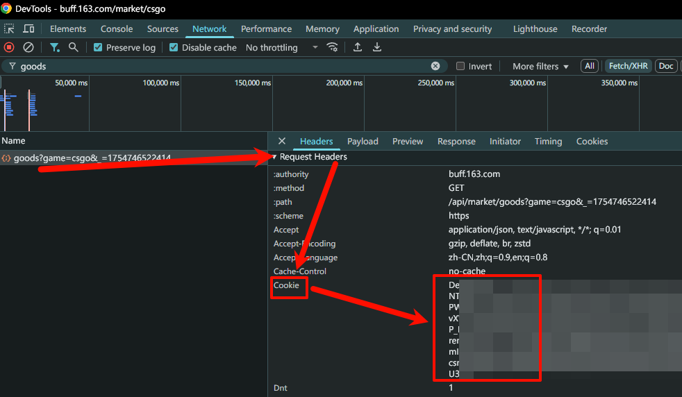

# 如何更新武器箱？

1. 登录 [BUFF](https://buff.163.com/)，注意登录时候需要勾选10天有效
2. 按 f12 打开控制台选择网络
3. 选择一个请求查看

4. 将`Cookie`对应的内容复制到`data/config.yaml`中开箱的`COOKIE`字段中进行重载配置或重启
5. 发送 `更新武器箱 ALL`

> [!WARNING]
>
> 过多的请求会导致 buff 封禁 IP 或账号，因此每次更新时间会比较久  
> 同时也不要过多请求，一天一次更新所有武器箱是在接受范围内  
> 具体边界自行探索（
